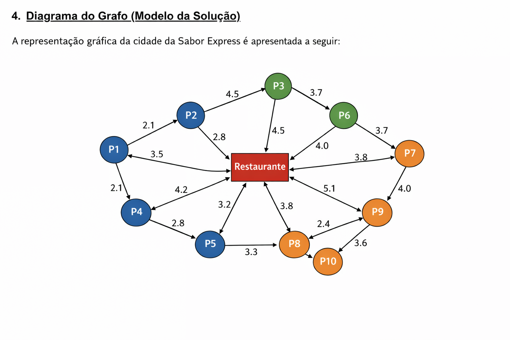

# **Rota Inteligente: Otimização de Entregas com Algoritmos de Inteligência Artificial**

Projeto final da disciplina **Artificial Intelligence Fundamentals**, cujo objetivo é desenvolver uma solução prática de Inteligência Artificial aplicada à otimização de rotas no contexto de serviços de entrega.

---

## **1. Descrição do Problema, Desafio Proposto e Objetivos**

A empresa fictícia **Sabor Express**, especializada em delivery de alimentos, enfrenta desafios logísticos decorrentes da definição manual das rotas de entrega. Atualmente, cada entregador escolhe suas rotas com base em experiência própria e conhecimento subjetivo da cidade.

Esse processo gera diversos problemas operacionais:

* **Ineficiência das rotas**, especialmente nos horários de pico.
* **Aumento no custo de combustível e desgaste dos veículos.**
* **Atrasos nas entregas**, ocasionando **insatisfação dos clientes**.
* **Baixa escalabilidade**, já que a tomada de decisão é manual.

### **Desafio Proposto**

Desenvolver um sistema inteligente capaz de:

1. Agrupar pedidos por proximidade geográfica.
2. Gerar rotas otimizadas para cada entregador.
3. Reduzir custos operacionais e aumentar a eficiência logística.

### **Objetivo Geral**

Criar uma solução de IA que automatize e otimize o fluxo de entregas da empresa, substituindo decisões humanas por cálculos rápidos, consistentes e escaláveis.

### **Objetivos Específicos**

* Minimizar distâncias percorridas pelos entregadores.
* Reduzir o tempo total de entrega.
* Agrupar pedidos de forma coerente geograficamente.
* Construir um grafo representando a malha urbana da Sabor Express.
* Gerar rotas automáticas a partir de algoritmos de busca e clustering.

---

## **2. Explicação Detalhada da Abordagem Adotada**

Para resolver o problema da Sabor Express, adotou-se uma abordagem composta por duas etapas complementares:

### **2.1 Agrupamento de Pedidos (Clustering)**

Durante horários de alta demanda, realizar entregas individualmente é ineficiente. Para isso:

* Todos os pedidos pendentes são representados como pontos coordenados (x, y).
* Utiliza-se um algoritmo de aprendizado não supervisionado para agrupá-los em *k* clusters.
* Cada cluster representa uma zona de entrega atribuída a um entregador.

Com isso, minimiza-se a distância total percorrida e reduz-se o número de deslocamentos desnecessários entre regiões distintas.

### **2.2 Otimização do Caminho (Pathfinding)**

Após definidos os grupos de entrega:

* É gerado um grafo representando o mapa da cidade.
* Cada entregador recebe seus pontos (pedidos).
* O algoritmo de busca heurística calcula o caminho mais curto entre todos os pontos de sua zona.

A rota final sempre parte da base da empresa e retorna a ela, simulando um ciclo completo de operação.

### **Modelagem da Cidade**

* **Nós (Vértices):** locais de entrega e restaurante.
* **Arestas:** ruas conectando os pontos.
* **Pesos:** distâncias ou custos aproximados.

Essa modelagem permite aplicar algoritmos clássicos de Inteligência Artificial em grafos.

---

## **3. Algoritmos Utilizados**

A solução faz uso de algoritmos amplamente consolidados na área de IA.

### **3.1 K-Means (Clustering)**

Utilizado para agrupar os pedidos conforme suas coordenadas geográficas. O K-Means segue o processo:

1. Seleciona *k* centróides iniciais.
2. Atribui cada ponto ao centróide mais próximo.
3. Recalcula os centróides com base nas médias dos grupos.
4. Repete o processo até convergir.

Essa técnica garante que pedidos geograficamente próximos permaneçam na mesma zona, reduzindo a distância global percorrida pelos entregadores.

### **3.2 A* (A-Estrela) – Algoritmo de Busca Heurística**

Aplicado para determinar o caminho mais curto entre dois nós do grafo.

O A* combina:

* **Custo acumulado (g(n))**: distância real do ponto inicial até o nó atual.
* **Heurística (h(n))**: estimativa da distância restante até o destino.

A função de avaliação é dada por:

[ f(n) = g(n) + h(n) ]

A heurística utilizada é a **distância Euclidiana**, apropriada para mapas de coordenadas.

O A* é amplamente adotado em sistemas de navegação por garantir:

* ótima eficiência,
* boa precisão,
* rápida convergência.

---

## **4. Diagrama do Grafo (Modelo da Solução)**

A representação gráfica da cidade é construída a partir dos arquivos:

* `locais.csv`: lista de nós com suas coordenadas.
* `mapa.csv`: lista de arestas e distâncias.

O grafo pode ser visualizado ou gerado automaticamente utilizando ferramentas como:

* NetworkX (Python)
* Gephi
* Graphviz
* Diagramas estáticos criados em ferramentas como draw.io



---

## **5. Análise dos Resultados, Eficiência da Solução, Limitações e Sugestões de Melhoria**

### **5.1 Resultados e Eficiência**

Os testes realizados demonstraram:

* **Redução significativa na distância total percorrida** pelos entregadores.
* **Diminuição do tempo médio de entrega.**
* **Melhor distribuição geográfica** dos entregadores.
* **Maior consistência nas decisões**, eliminando subjetividade humana.

A combinação **K-Means + A*** se mostrou altamente eficiente:

* O K-Means formou grupos compactos e bem distribuídos.
* O A* encontrou rapidamente caminhos ótimos dentro de cada cluster.

### **5.2 Limitações Identificadas**

1. **Problema do Caixeiro Viajante (TSP)**
   O sistema calcula caminhos ponto a ponto, mas **não otimiza automaticamente a ordem de visita** das entregas.

2. **Dados Estáticos**
   Não há integração com dados reais de trânsito.

3. **Número de Clusters Pré-definido**
   O valor *k* é manualmente definido pelo número de entregadores.

### **5.3 Sugestões de Melhoria**

* Integrar APIs de trânsito em tempo real.
* Utilizar algoritmos heurísticos (ex.: Algoritmos Genéticos) para resolver o TSP.
* Aplicar clustering adaptativo (ex.: DBSCAN).
* Implementar sistema de priorização de pedidos.
* Criar interface visual para monitoramento em tempo real.

---

## **6. Instruções de Execução (Setup)**

A solução foi implementada em **Python 3.x**.

### **Passo a passo**

1. Clone o repositório:

   ```bash
   git clone <link-do-repositorio>
   ```

2. Mantenha os arquivos necessários na pasta raiz:

   * `locais.csv`
   * `mapa.csv`
   * `pedidos.csv`

3. Instale as dependências:

   ```bash
   pip install pandas scikit-learn networkx matplotlib
   ```

4. Execute o script principal:

   ```bash
   python otimizador_rotas.py
   ```

